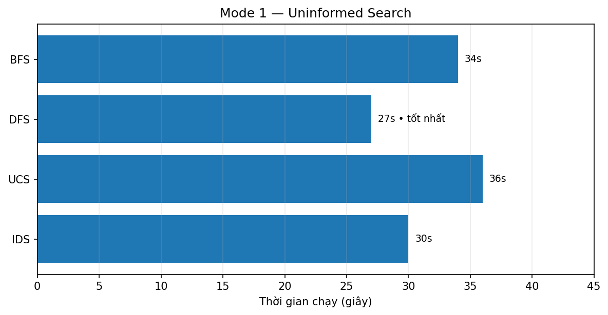
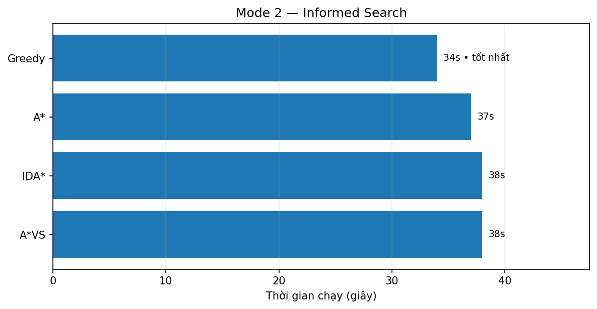
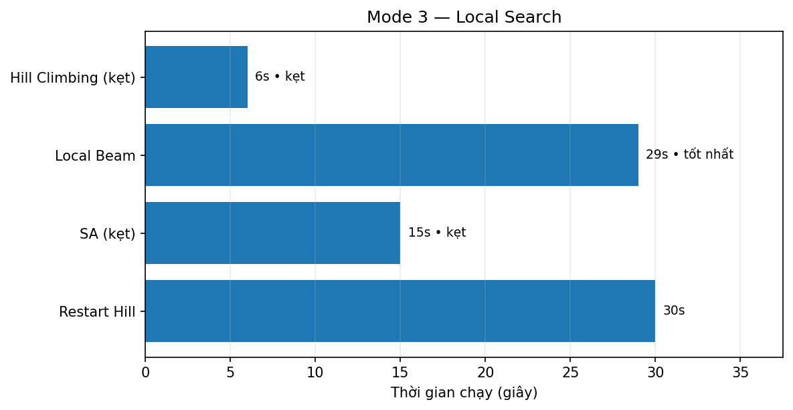
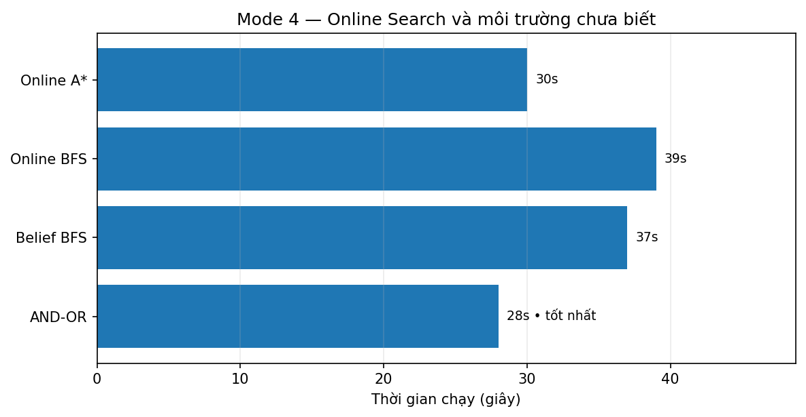
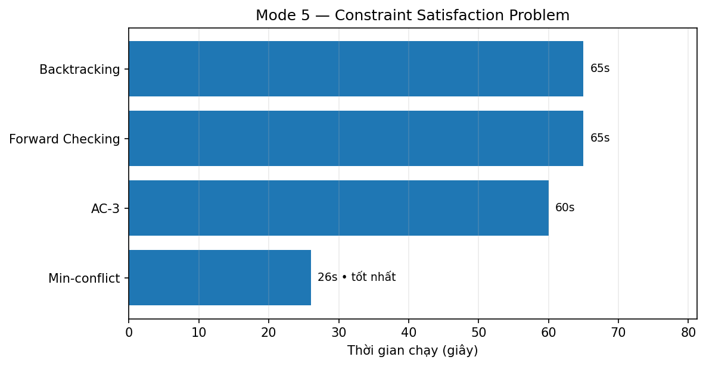
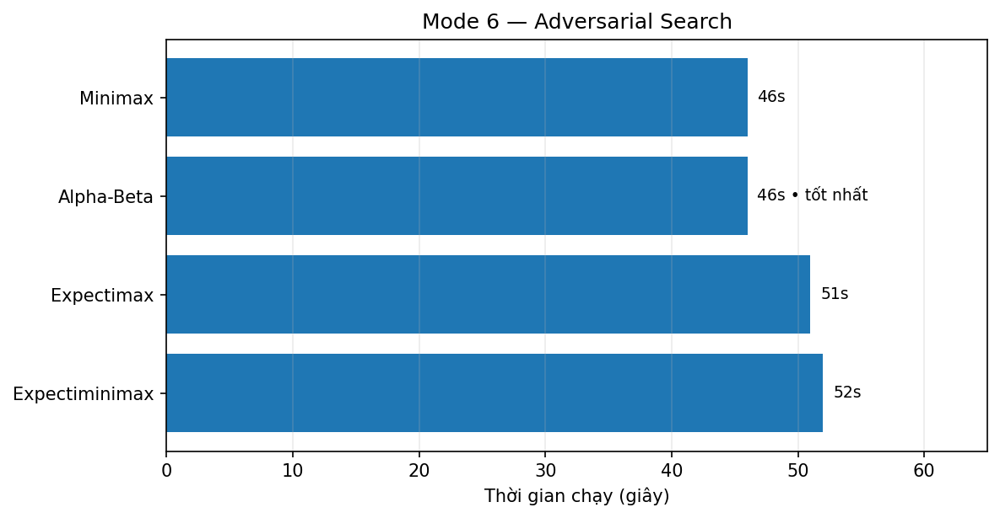
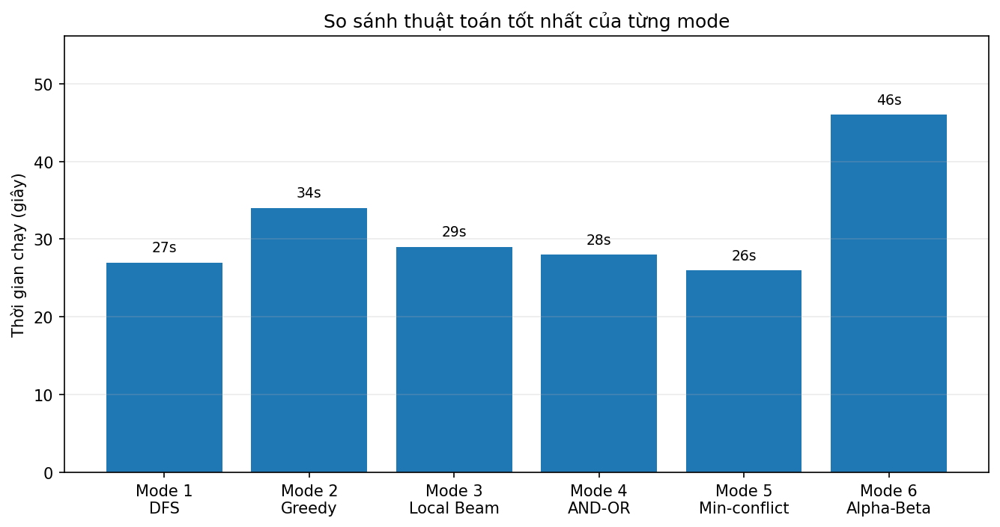

# Smart Farm AI Robot

## Thông tin nhóm thực hiện

| Thông tin | Nội dung |
|---|---|
| Môn học | Trí tuệ nhân tạo |
| Lớp | ARIN330585_08 |
| Giảng viên | Phan Thị Huyền Trang |

### Nhóm thực hiện

| STT | Họ và tên | MSSV |
|---:|---|---|
| 1 | Nguyễn Thanh Tâm | 24133052 |
| 2 | Bùi Phạm Đức Thắng | 24133056 |
| 3 | Trần Thị Phương Trang | 24133065 |
| 4 | Phạm Quý Vỹ | 24133077 |

---

Đồ án mô phỏng robot nông nghiệp **AGRI-1** khôi phục khu vườn sau bão bằng các thuật toán Trí tuệ nhân tạo. Game được xây dựng bằng **Python** và **Pygame**, trong đó mỗi khu vực trên bản đồ đại diện cho một nhóm thuật toán khác nhau.

Robot không chỉ di chuyển theo đường có sẵn mà phải tự chọn mục tiêu, tìm đường, cập nhật trạng thái môi trường và xử lý nhiệm vụ. Nhờ mô phỏng trên bản đồ lưới, quá trình hoạt động của từng thuật toán có thể được quan sát trực tiếp thông qua đường đi, node đã duyệt, trạng thái cây, vùng quan sát, đối thủ và các hiệu ứng trong game.

---

## 1. Mục tiêu dự án

Dự án được thực hiện nhằm:

- Trực quan hóa các thuật toán AI trong một môi trường game dễ quan sát.
- So sánh cách robot ra quyết định giữa các nhóm thuật toán khác nhau.
- Mô phỏng nhiều dạng bài toán AI: tìm kiếm đường đi, tìm kiếm có heuristic, tìm kiếm cục bộ, môi trường chưa biết, bài toán ràng buộc và tìm kiếm đối kháng.
- Xây dựng một sản phẩm hoàn chỉnh có giao diện, bản đồ, nhân vật, hiệu ứng, GIF minh họa và biểu đồ so sánh kết quả chạy.

---

## 2. Công nghệ sử dụng

| Thành phần | Công nghệ |
|---|---|
| Ngôn ngữ lập trình | Python |
| Thư viện game | Pygame |
| Bản đồ | Tiled Map Editor, TMX, pytmx |
| Kiểu bản đồ | Grid map |
| Heuristic chính | Manhattan Distance |
| Trực quan hóa | HUD, đường đi, node đã duyệt, fog-of-war, hiệu ứng đối thủ, GIF, biểu đồ |
| Dữ liệu so sánh | `algorithm_time_success.csv` |

---

## 3. Cách chạy chương trình

Cài đặt thư viện cần thiết:

```bash
pip install pygame pytmx
```

Nếu đang đứng ở thư mục gốc của project, chạy:

```bash
python code/main.py
```

Nếu đã mở trực tiếp thư mục `code`, chạy:

```bash
python main.py
```

Sau khi chạy, cửa sổ **Smart Farm AI Robot** sẽ hiển thị. Người dùng có thể chọn từng khu vực, đổi thuật toán và quan sát robot tự xử lý nhiệm vụ.

---

## 4. Hướng dẫn điều khiển

| Phím / thao tác | Chức năng |
|---|---|
| `1` đến `6` | Chuyển khu vực/mode |
| `Q` | Chọn thuật toán trước trong cùng nhóm |
| `E` | Chọn thuật toán tiếp theo trong cùng nhóm |
| Chuột trái | Chọn thuật toán, Start, Pause hoặc Reset trên panel |
| `Enter` ở Mode 6 | Chuyển sang màn hình kết thúc |

---

## 5. Mô hình bài toán

Trong game, bản đồ được biểu diễn như một không gian trạng thái dạng lưới. Mỗi trạng thái có thể gồm vị trí robot, danh sách ô đã xử lý, danh sách ô còn lại, vật cản, đường đi hiện tại và các trạng thái riêng của từng mode.

Luồng xử lý chung của robot:

```text
Chọn mục tiêu → Tìm đường → Di chuyển → Xử lý cây/ô đất → Cập nhật trạng thái
```

Tùy thuật toán được chọn, robot sẽ có cách duyệt node, chọn mục tiêu, lập kế hoạch và cập nhật trạng thái khác nhau.

---

## 6. Tổng quan các nhóm thuật toán

Project chia các thuật toán thành 6 nhóm chính tương ứng với 6 mode trong game:

| Mode | Nhóm thuật toán | Vai trò mô phỏng |
|---|---|---|
| Mode 1 | Uninformed Search | Tìm kiếm đường đi khi chưa có heuristic |
| Mode 2 | Informed Search | Tìm kiếm có định hướng bằng hàm đánh giá |
| Mode 3 | Local Search | Tối ưu lựa chọn cục bộ, dễ gặp cực trị địa phương |
| Mode 4 | Online Search / Unknown Environment | Vừa di chuyển vừa cập nhật môi trường chưa biết |
| Mode 5 | Constraint Satisfaction Problem | Gieo cây theo các ràng buộc hợp lệ |
| Mode 6 | Adversarial Search | Ra quyết định khi có đối thủ và yếu tố ngẫu nhiên |
---

## 7. Các nhóm thuật toán đã triển khai

### 7.1. Mode 1 — Uninformed Search

Mode 1 mô phỏng nhóm thuật toán tìm kiếm không có thông tin. Robot chưa dùng heuristic mà chỉ dựa vào trạng thái ban đầu, trạng thái đích và các hành động hợp lệ.

| Thuật toán | Ý tưởng chính | GIF minh họa |
|---|---|---|
| BFS | Duyệt theo từng tầng, tìm đường ngắn nhất nếu chi phí mỗi bước bằng nhau |  |
| DFS | Duyệt sâu theo một nhánh trước khi quay lại |  |
| UCS | Ưu tiên đường đi có tổng chi phí thấp nhất |  |
| IDS | Lặp DFS với giới hạn độ sâu tăng dần |  |

Nhóm thuật toán này phù hợp để minh họa nền tảng của tìm kiếm trạng thái. BFS và IDS có tính ổn định cao hơn, DFS tiết kiệm bộ nhớ hơn, còn UCS có ý nghĩa rõ khi bản đồ có chi phí di chuyển khác nhau.

**Biểu đồ so sánh Mode 1:**



Kết quả thực nghiệm cho thấy **DFS** có thời gian thấp nhất trong Mode 1 với **27 giây**.

---

### 7.2. Mode 2 — Informed Search

Mode 2 sử dụng heuristic để robot chọn đường đi tốt hơn. Heuristic chính là khoảng cách Manhattan kết hợp với độ ưu tiên của cây cần xử lý.

Công thức sử dụng:

```text
h(n) = Manhattan(n, target) + 2 * condition(target)
f(n) = g(n) + h(n)
```

| Thuật toán | Ý tưởng chính | GIF minh họa |
|---|---|---|
| Greedy | Chọn node có `h(n)` nhỏ nhất |  |
| A* | Kết hợp chi phí đã đi `g(n)` và heuristic `h(n)` |  |
| A*VS | A* có thêm biến thể đánh giá để so sánh hiệu quả tìm đường |  |
| IDA* | Tìm kiếm theo ngưỡng `f(n)` tăng dần |  |

So với Mode 1, nhóm này giúp robot di chuyển có định hướng hơn. Greedy phản ứng nhanh nhưng có thể chọn đường chưa tối ưu. A* cân bằng tốt hơn vì xét cả chi phí đã đi và ước lượng còn lại.

**Biểu đồ so sánh Mode 2:**



Kết quả thực nghiệm cho thấy **Greedy** có thời gian thấp nhất trong Mode 2 với **34 giây**.

---

### 7.3. Mode 3 — Local Search

Mode 3 mô phỏng nhóm thuật toán tìm kiếm cục bộ. Robot không duyệt toàn bộ không gian trạng thái mà tập trung cải thiện lựa chọn hiện tại hoặc một nhóm ứng viên gần nhất.

Điểm đánh giá được xây dựng dựa trên loại cây và khoảng cách Manhattan:

```text
score = điểm loại cây + Manhattan(current, tile) - turn_penalty
```

| Thuật toán | Ý tưởng chính | GIF minh họa |
|---|---|---|
| Hill Climbing | Chọn trạng thái lân cận tốt hơn hiện tại |  |
| Local Beam | Giữ nhiều ứng viên tốt nhất cùng lúc |  |
| Simulated Annealing | Đôi khi chấp nhận bước xấu để thoát kẹt cục bộ |  |
| Random Restart Hill | Khởi động lại khi bị kẹt ở cực trị cục bộ |  |

Nhóm Local Search cho thấy robot có thể ra quyết định nhanh trong khu vực nhỏ, nhưng cũng dễ bị ảnh hưởng bởi cực trị cục bộ nếu chỉ nhìn vào lựa chọn gần nhất.

**Biểu đồ so sánh Mode 3:**



Trong lần chạy thực nghiệm, **Hill Climbing** và **Simulated Annealing** bị kẹt nên không được chọn dù thời gian dừng thấp. Trong các thuật toán hoàn thành, **Local Beam** tốt nhất với **29 giây**.

---

### 7.4. Mode 4 — Online Search và môi trường chưa biết

Mode 4 đặt robot vào khu vực có sương mù và vật cản ẩn. Robot không biết toàn bộ bản đồ ngay từ đầu mà phải vừa di chuyển, vừa quan sát, vừa cập nhật lại kế hoạch.

| Thuật toán | Ý tưởng chính | GIF minh họa |
|---|---|---|
| Online A* | Lập kế hoạch lại khi có thông tin mới |  |
| Online BFS | Duyệt theo lớp trong môi trường được khám phá dần |  |
| Belief-State BFS | Tìm kiếm trên tập trạng thái có thể xảy ra |  |
| AND-OR Search | Lập kế hoạch cho nhiều kết quả có thể xảy ra |  |

Mode này thể hiện rõ sự khác biệt giữa môi trường biết trước và môi trường chưa biết. Robot phải liên tục cập nhật thông tin thay vì chỉ chạy một kế hoạch cố định từ đầu đến cuối.

**Biểu đồ so sánh Mode 4:**



Kết quả thực nghiệm cho thấy **AND-OR Search** có thời gian thấp nhất trong Mode 4 với **28 giây**.

---

### 7.5. Mode 5 — Constraint Satisfaction Problem

Mode 5 mô phỏng bài toán thỏa mãn ràng buộc. Robot cần gieo cây trên lưới sao cho các ô liền kề không vi phạm điều kiện đã đặt ra.

Các loại cây được sử dụng:

```text
corn, tomato, wheat, carrot
```

Một số ràng buộc chính:

- Hai ô kề nhau không được trồng cùng loại cây.
- Cặp `corn - tomato` không được đứng cạnh nhau.
- Cặp `wheat - carrot` không được đứng cạnh nhau.

| Thuật toán | Ý tưởng chính | GIF minh họa |
|---|---|---|
| Backtracking | Thử gán giá trị và quay lui khi vi phạm |  |
| Forward Checking | Loại trước giá trị không còn hợp lệ ở biến lân cận |  |
| AC-3 | Duy trì tính nhất quán cung giữa các biến |  |
| Min-conflict | Sửa dần các biến đang gây xung đột |  |

Nhóm CSP giúp minh họa bài toán không chỉ cần tìm đường đi mà còn cần tìm một cách sắp xếp thỏa tất cả điều kiện.

**Biểu đồ so sánh Mode 5:**



Kết quả thực nghiệm cho thấy **Min-conflict** có thời gian thấp nhất trong Mode 5 với **26 giây**.

---

### 7.6. Mode 6 — Adversarial Search

Mode 6 là khu vực đối kháng. Robot AGRI-1 đóng vai trò **MAX**, có nhiệm vụ bảo vệ và sửa cây. Đối thủ đóng vai trò **MIN**, cố gắng phá cây. Một số thuật toán còn có thêm yếu tố ngẫu nhiên như sét đánh hoặc cột thu lôi.

| Thuật toán | Ý tưởng chính | GIF minh họa |
|---|---|---|
| Minimax | MAX chọn nước đi tốt nhất, giả định MIN cũng tối ưu |  |
| Alpha-Beta | Tối ưu Minimax bằng cách cắt tỉa nhánh không cần xét |  |
| Expectimax | Thêm node xác suất để mô phỏng sự kiện ngẫu nhiên |  |
| Expectiminimax | Kết hợp MAX, MIN và CHANCE trong cùng cây quyết định |  |

Mode này thể hiện bài toán ra quyết định khi có đối thủ. Robot không chỉ cần chọn cây gần nhất, mà phải cân nhắc nước đi của đối phương và rủi ro từ các sự kiện ngẫu nhiên.

**Biểu đồ so sánh Mode 6:**



Kết quả thực nghiệm cho thấy **Minimax** và **Alpha-Beta** cùng đạt **46 giây**. Báo cáo chọn **Alpha-Beta** làm đại diện tốt nhất vì thuật toán này giữ nguyên logic Minimax nhưng có thêm cơ chế cắt tỉa nhánh.

---

## 8. So sánh thuật toán tốt nhất giữa các mode

Sau khi lấy thuật toán hoàn thành có thời gian thấp nhất trong từng mode, kết quả đại diện như sau:

| Mode | Thuật toán tốt nhất | Thời gian |
|---|---|---:|
| Mode 1 | DFS | 27s |
| Mode 2 | Greedy | 34s |
| Mode 3 | Local Beam | 29s |
| Mode 4 | AND-OR | 28s |
| Mode 5 | Min-conflict | 26s |
| Mode 6 | Alpha-Beta | 46s |



Theo số liệu thực nghiệm, **Min-conflict** là thuật toán có thời gian tốt nhất trong toàn bộ các thuật toán đại diện, với **26 giây**. Tuy nhiên, kết quả này không có nghĩa Min-conflict tốt hơn trong mọi bài toán, mà cho thấy nó phù hợp nhất với bài toán ràng buộc ở Mode 5 trong môi trường demo hiện tại.

---

## 9. Kết quả đạt được

Dự án đã hoàn thành một game demo có thể chạy trực tiếp, gồm 6 khu vực tương ứng với 6 nhóm thuật toán AI. Mỗi nhóm thuật toán được gắn với một tình huống cụ thể trong game để người xem dễ hiểu vai trò của thuật toán.

Các kết quả chính:

- Xây dựng được bản đồ nông trại gồm nhiều khu vực demo riêng biệt.
- Tích hợp robot tự động di chuyển, tìm mục tiêu và xử lý nhiệm vụ.
- Cài đặt các nhóm thuật toán: Uninformed Search, Informed Search, Local Search, Online Search, CSP và Adversarial Search.
- Hiển thị được đường đi, node đã duyệt, thông số `f(n)`, `g(n)`, `h(n)`, trạng thái belief, bước backtracking và quyết định đối kháng.
- Tạo GIF minh họa cho từng thuật toán.
- Tạo biểu đồ so sánh thời gian chạy theo từng mode và so sánh thuật toán tốt nhất giữa các mode.

---
## 10. Nguồn tham khảo, credit và license

### 10.1. License source code tham khảo

Dự án có sử dụng, tham khảo hoặc tùy biến một số thành phần từ phần mềm được cấp phép theo **MIT License**. Nhóm giữ lại thông tin bản quyền và nội dung giấy phép gốc để tuân thủ điều kiện sử dụng của tác giả.

Thông tin bản quyền gốc:

```text
Copyright (c) 2024 Artem Shchirov
```

MIT License cho phép sử dụng, sao chép, chỉnh sửa, gộp, phân phối và cấp phép lại phần mềm, với điều kiện phải giữ nguyên thông báo bản quyền và nội dung giấy phép trong các bản sao hoặc phần quan trọng của phần mềm.

Nội dung license gốc đã được lưu trong file:

```text
LICENSE
THIRD_PARTY_LICENSES.md
```

### 10.2. Credit tài nguyên đồ họa

Dự án có sử dụng và tùy biến một số tài nguyên đồ họa pixel-art từ **Sprout Lands Asset Pack** của **Cup Nooble**. Các tài nguyên này được dùng cho mục đích học tập, minh họa giao diện và xây dựng môi trường game.

Nguồn của tác giả:

- Cup Nooble: https://cupnooble.carrd.co/
- Cup Nooble YouTube: https://www.youtube.com/@Cup_Nooble
- Sprout Lands Asset Pack: https://cupnooble.itch.io/sprout-lands-asset-pack

Trích nguồn ngắn gọn:

```text
Cup Nooble. (n.d.). Sprout Lands Asset Pack. itch.io.
https://cupnooble.itch.io/sprout-lands-asset-pack

Cup Nooble. (n.d.). Cup Nooble official links.
https://cupnooble.carrd.co/
```

Bản quyền gốc của các asset thuộc về tác giả Cup Nooble. Dự án này chỉ sử dụng tài nguyên trong phạm vi học tập và báo cáo môn học. Nếu phát triển hoặc phát hành ở phạm vi thương mại, cần kiểm tra lại điều khoản sử dụng chính thức của asset pack.

### 10.3. Ghi chú sử dụng trong đồ án

Toàn bộ phần cài đặt, chỉnh sửa logic game, tích hợp thuật toán, giao diện demo, animation và báo cáo được nhóm thực hiện nhằm phục vụ đồ án môn học. Các phần có sử dụng tài nguyên hoặc mã nguồn bên thứ ba đã được ghi rõ ở mục credit/license để đảm bảo minh bạch nguồn gốc.
